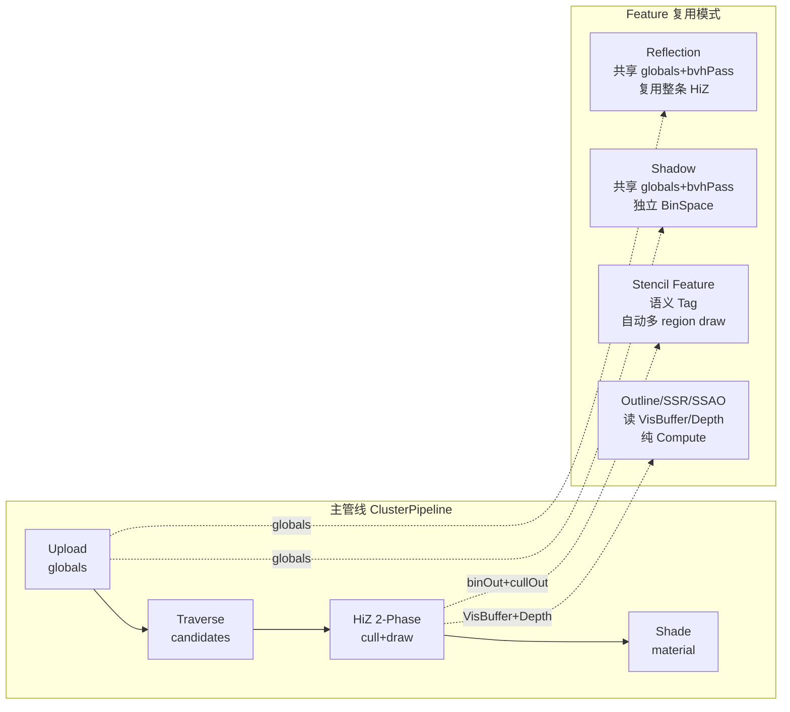

# Stage 复用与管线资源共享 — 用例手册

## 三层架构

| 层级 | 实例 | 状态 | 职责 |
|-----|------|------|------|
| **RenderPass** | `ClusterBVHTraversePass` | 持有跨帧 readback 状态 | 最细粒度 GPU 命令，barrier 由 RG 管理 |
| **Stage（静态函数）** | `ClusterTraverse.AddPasses` | **无状态** | 编排 Pass + 创建 RG 资源 |
| **Feature / Pipeline** | `ClusterPipeline` | 持有 Pass 实例 / PingPong / PSO | 组合 Stage，管理跨帧资源 |

---

## 资源共享的三种方式

```csharp
// 1. Pipeline 公开属性 — 获取完整 Stage 产出
var globals = pipeline.LastGlobalResources;    // BVH/PageHeap/Transform/InstanceHeader
var cullOut = pipeline.LastCullOutput;           // VisibleClusters/DrawArgs
var raster  = pipeline.LastOpaqueRasterOutput;  // VisBuffer/DepthTarget

// 2. RenderGraph 名称 — 获取已创建的 RG 资源
var hDepth = graph.GetResourceHandle("DepthTarget");

// 3. Stage 产出 record — Stage 间数据流
var traverseOut = ClusterTraverse.AddPasses(...);
var cullOut     = ClusterCull.AddPasses(..., traverseOut, ...);
```

> [!IMPORTANT]
> **TraversePass 共享规则**：`ClusterBVHTraversePass` 持有跨帧 readback 状态。
> 不需要 readback 的 Feature（阴影/小地图）**直接复用主管线的实例**。
> `SetFrameData` 的相机参数已冗余（`CullingUniforms` UB 包含完整数据），
> 未来会移除，届时所有 Feature 可无条件共享同一实例。

---

## BinSpace：per-Feature 的 Bin 命名空间

`BinSpace` **不是全局单例**。每个概念独立的 Feature 可拥有自己的 Space：

```
主管线 BinSpace              阴影 Feature BinSpace
┌─────────────────┐         ┌──────────────────┐
│ field "RasterBin"│         │ field "ShadowBin" │  ← 只关心 alpha test 与否
│ field "ShadingBin"│        └──────────────────┘
│   region "Opaque" │            独立 SlotBuffer
│   region "AlphaTest"│          独立 field/region 布局
│   region "Stencil..."│
└─────────────────┘
```

```csharp
// Feature 自己的 BinSpace — 完全独立的 bin 逻辑
var _myBinSpace = new BinSpace();
int _myFieldIdx = _myBinSpace.RegisterField("ShadowBin");
_myBinSpace.RegisterRegion(_myFieldIdx, "AlphaTest",
    () => registry.QueryPasses(p => p.Tags.Has<AlphaTestTag>()),
    p => p.ShaderAsset.Id);
_myBinSpace.FreezeLayout();

// Feature 想和主管线共享？直接用同一个 BinSpace 实例
// 但概念差距大时（阴影 vs 主着色），独立 Space 更干净
```

**层级总结**：

| 概念 | 含义 | 何时使用 |
|------|------|---------|
| 多 **Space** | 概念隔离的 Feature | 阴影 vs 主管线、毛发 vs 主管线 |
| 多 **Field** | 同一 Space 内正交维度 | "怎么光栅化" vs "怎么着色" |
| 多 **Region** | 同一 Field 内有序分组 | Opaque / AlphaTest / StencilWrite / StencilTest |

---

## 用例 1：级联阴影

> 复用 **globals + TraversePass**，独立 BinSpace（阴影只按 alpha test 分 bin）。

```csharp
public class CascadedShadowFeature : IRenderFeature
{
    public string Name => "CascadedShadows";
    public int CascadeCount { get; set; } = 4;
    public RenderGraphHandle[] ShadowMaps { get; private set; }

    private BinSpace _binSpace = new();
    private int _binFieldIdx;

    public void Initialize(RenderContext ctx)
    {
        // 独立 BinSpace：阴影只关心 "是否 alpha test"
        _binFieldIdx = _binSpace.RegisterField("ShadowBin");
        _binSpace.RegisterRegion(_binFieldIdx, "Opaque",
            () => registry.QueryPasses(p => !p.Tags.Has<AlphaTestTag>()),
            p => 0);  // 所有不透明共享 bin 0
        _binSpace.RegisterRegion(_binFieldIdx, "AlphaTest",
            () => registry.QueryPasses(p => p.Tags.Has<AlphaTestTag>()),
            p => p.ShaderAsset.Id);
        _binSpace.FreezeLayout();
    }

    public void AddPasses(RenderGraph graph)
    {
        // 复用主管线全局资源（不重复上传 BVH/PageHeap）
        var globals = _mainPipeline.LastGlobalResources;
        // 复用主管线的 TraversePass 实例（阴影不需要 readback）
        var bvhPass = _mainPipeline.BVHTraversePass;

        _binSpace.RebuildIfDirty(registry);
        var hSlots = _binSpace.AddUploadPass(graph);
        ShadowMaps = new RenderGraphHandle[CascadeCount];

        for (int i = 0; i < CascadeCount; i++)
        {
            var lightCam = ClusterCameraData.Default(
                lightViews[i], lightProjs[i], lightPos[i],
                shadowRes, shadowRes
            ) with { LodScale = 2000f };

            // 复用 Traverse Stage（同一 bvhPass 实例, 不同相机）
            var traverse = ClusterTraverse.AddPasses(
                graph, _ctx, bvhPass, clusterMgr, instanceMgr,
                globals, lightCam, ClusterTraverseConfig.Default());

            // Legacy Cull（阴影无需 HiZ）
            var cullOut = ClusterCull.AddPasses(graph, _ctx, traverse, globals,
                traverse.CullingUniforms,
                ClusterCullConfig.Default() with { HiZMode = HiZDebugMode.Legacy },
                RenderGraphHandle.Invalid, RenderGraphHandle.Invalid,
                false, RenderGraphHandle.Invalid);

            var binOut = ClusterRasterBin.AddPasses(graph, _ctx, cullOut,
                globals.GlobalInstanceHeader, cullOut.DrawArgs,
                RenderGraphHandle.Invalid, hSlots,
                (uint)_binSpace.SlotCapacity, (uint)_binFieldIdx,
                tag: $"Shadow_C{i}");

            ShadowMaps[i] = graph.CreateTexture($"ShadowMap_C{i}", shadowDepthDesc);

            // 只写深度，不要 VisBuffer
            ClusterDraw.AddPasses(graph, _ctx, binOut, cullOut, globals,
                hShadowUB,
                ClusterDrawConfig.Opaque() with {
                    UseVisBuffer = false,
                    Tag = $"Shadow_C{i}",
                },
                ShadowMaps[i], shadowRes, shadowRes);

            graph.MarkOutput(ShadowMaps[i]);
        }
    }
}
```

---

## 用例 2：屏幕空间描边（只读主管线产出）

> 纯 Compute，不复用任何 Stage，只读 VisBuffer + VisibleClusters。

```csharp
public class OutlineFeature : IRenderFeature
{
    public string Name => "Outline";
    public HashSet<uint> SelectedInstances { get; } = new();

    public void AddPasses(RenderGraph graph)
    {
        var raster = _mainPipeline.LastOpaqueRasterOutput;
        var cull   = _mainPipeline.LastCullOutput;
        var color  = graph.GetResourceHandle("ColorTarget");

        var hMask = graph.CreateTexture("OutlineMask", maskDesc);

        // Pass 1：标记选中物体
        graph.AddPass("OutlineMark",
            builder => {
                builder.Read(raster.VisBuffer, ResourceState.ShaderResource);
                builder.Read(cull.VisibleClusters, ResourceState.ShaderResource);
                builder.Write(hMask, ResourceState.UnorderedAccess);
            },
            ctx => { /* CS: VisBuffer→InstanceID→比对 SelectedSet→写 Mask */ });

        // Pass 2：边缘检测 + 合成
        graph.AddPass("OutlineComposite",
            builder => {
                builder.Read(hMask, ResourceState.ShaderResource);
                builder.ReadWrite(color, ResourceState.UnorderedAccess);
            },
            ctx => { /* CS: 邻域采样 Mask→边缘高亮→叠加 ColorTarget */ });
    }
}
```

---

## 用例 3：平面反射（复用整条 HiZ 2-Phase）

> 共享 globals，镜像相机，一行调用复用完整 2-phase 管线。

```csharp
public class PlanarReflectionFeature : IRenderFeature
{
    public string Name => "PlanarReflection";
    public RenderGraphHandle ReflectionColor { get; private set; }

    private PingPongHandle _hizPingPong = new();
    private BinSpace _binSpace = new();  // 可共享主管线的，也可独立
    private int _binFieldIdx;

    public void AddPasses(RenderGraph graph)
    {
        var globals = _mainPipeline.LastGlobalResources;
        var reflCam = BuildMirrorCamera(reflectionPlane, _camera);

        var traverse = ClusterTraverse.AddPasses(
            graph, _ctx, _mainPipeline.BVHTraversePass, clusterMgr, instanceMgr,
            globals, reflCam, ClusterTraverseConfig.Default());

        var hSlots = _binSpace.AddUploadPass(graph);
        var hReflDepth = graph.CreateTexture("ReflDepth", depthDesc);
        var hDrawUB = CreateDynamicUniformPass(graph, "ReflDrawUB", reflDrawData);

        // 一行复用完整 2-Phase 编排
        var result = ClusterHiZ.Add2PhasePipeline(
            graph, _ctx, traverse, globals, reflCam, hDrawUB,
            hSlots, _binSpace, _binFieldIdx, _hizPingPong, hReflDepth,
            new ClusterHiZ.HiZConfig { HiZMode = HiZDebugMode.Full2Phase });

        ReflectionColor = result.Raster.VisBuffer;
        graph.MarkOutput(ReflectionColor);
    }
}
```

---

## 用例 4-7：只读产出的后处理 Feature

这类 Feature 只读取主管线的 VisBuffer/Depth/Color，用 Compute pass 处理。模式统一：

| Feature | 读取 | 写入 | 用途 |
|---------|------|------|------|
| **软粒子** | `DepthTarget` | `ColorTarget` | depth diff → alpha fade |
| **SSR** | `Depth + VisBuffer + Color` | `SSRResult` → `Color` | ray march + composite |
| **SSAO** | `DepthTarget` | `AOTexture`（供 Shade 读） | HBAO+ → bilateral blur |
| **Decals** | `VisBuffer + Depth + PageHeap` | `ColorTarget` | 反投影 → decal 纹理采样 |

```csharp
// 典型模式：1-2 个 Compute pass，只用 graph.AddPass
public void AddPasses(RenderGraph graph)
{
    var depth = _mainPipeline.LastOpaqueRasterOutput.DepthTarget;
    // ... graph.AddPass("XXX", builder => { builder.Read(...); }, ctx => { ... });
}
```

---

## Stencil：软光栅下的几何集合操作

### 问题

ClusterDraw 是**软光栅**（Compute Shader 原子写 VisBuffer + Depth UAV），没有硬件 stencil。
但游戏常需要几何集合操作：头发/头部交集阴影、Box 挖洞做窗户等。

### 方案：ClipMask UAV + 语义 Tag

在 Draw shader 中加可选的 `RWTexture2D<uint>` ClipMask 读/写，开销仅 1 次 UAV 读：

```hlsl
// cluster_draw.slang — 软光栅循环内
if (ClipMask[px] != 0 && ClipMask[px] != ClipRef) continue;  // 被裁剪
InterlockedMax(depthBuffer[px], packed);  // 正常原子深度测试
if (stencilWriteValue != 0) ClipMask[px] = stencilWriteValue; // 可选写入
```

对应 Config：

```csharp
public readonly record struct ClusterDrawConfig
{
    // ...existing...
    public RenderGraphHandle ClipMask { get; init; }  // R8_UINT, Invalid=不裁剪
    public byte ClipRef { get; init; }
    public bool ClipInvert { get; init; }
    public byte StencilWriteValue { get; init; }      // 0=不写
}
```

### 语义化描述

用户在材质 Tag 上声明 stencil 意图，系统自动推导 pass 顺序：

```csharp
// 声明式（材质注册时）
headMat.Tags.Set(new StencilWrite("Mask", value: 1));
hairMat.Tags.Set(new StencilTest("Mask", ref: 1, CompareFunc.Equal));
wallMat.Tags.Set(new StencilTest("Mask", ref: 1, CompareFunc.NotEqual));
```

系统自动构建 stencil 通道 DAG：

```
Channel "Mask":
  Writers: {headMat}           → region "Mask_Write"   先执行
  Readers: {hairMat, wallMat}  → region "Mask_Test_*"  后执行
```

链式依赖也能处理：

```csharp
headMat.Tags.Set(new StencilWrite("A", 1));
hairMat.Tags.Set(new StencilTest("A", 1, Equal),     // 读 A
                 new StencilWrite("B", 2));            // 写 B
shadowMat.Tags.Set(new StencilTest("B", 2, Equal));   // 读 B
// → 自动拓扑排序：Step0{head} → Step1{hair} → Step2{shadow}
// → 自动创建 2 个 ClipMask 纹理 (A, B)
```

### 执行

一个 Stage 调用，内部自动编排：

```csharp
// StencilResolver 分析 Tag → 拓扑排序 → 生成 region → 创建 ClipMask → 多次 ClusterDraw
ClusterStencil.AddStenciledDraw(
    graph, context, binOut, cullOut, globals, hDrawUB,
    binSpace, rasterFieldIdx, registry,
    depthTarget, screenWidth, screenHeight);
```

### 与 BinSpace 的关系

Stencil 操作是**同一 Field 内的多个 Region**（不是多 Field），因为
stencil 描述的是"如何光栅化"，与 RasterBin 同维度。不同 stencil 操作的物体
被自动分配到有序 region，Cull/RasterBin 只做一次，只有 Draw dispatch 按 region 多次执行。

```
RasterBin field:
  region "Opaque"         bins 0..5    普通不透明
  region "Mask_Write"     bins 6..7    StencilWrite 的材质
  region "Mask_Test_Eq"   bins 8..9    StencilTest Equal 的材质
  region "Mask_Test_NEq"  bins 10..11  StencilTest NotEqual 的材质
```

---

## 复用模式总结



| 复用程度 | 用例 | 共享资源 | 自有资源 |
|---------|------|---------|---------|
| **全管线** | 反射/小地图 | globals + bvhPass | 独立 PingPongHandle |
| **部分管线** | 阴影 | globals + bvhPass | 独立 BinSpace |
| **只读产出** | Outline/SSR/SSAO/Decals | VisBuffer/Depth/Color | 无 Stage |
| **Draw 扩展** | Stencil 集合操作 | Cull/RasterBin 结果 | ClipMask UAV |
