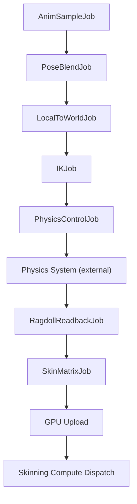

# 动画系统设计

## 1. 目标与约束

### 核心目标
基于 ECS + Job System 的高性能动画系统，完美融入 Nanite-like Cluster Rendering 管线。

### 关键约束
| 约束 | 原因 |
|------|------|
| **Zero-Alloc** | 与 Job System 一致，所有数据必须是 struct，存储在预分配池 |
| **GPU-Driven Skinning** | 蒙皮变形必须在 GPU 上完成，直接写入 Deformed Cluster Buffer |
| **Cluster 感知** | 蒙皮单位是 Cluster（≤128 tri），不是整个 Mesh |
| **与 Vis Buffer 统一** | 蒙皮 Mesh 的光栅/着色路径与静态 Mesh 共用同一 VisBuffer 编码 |
| **Span API only** | 禁止 unsafe，所有 buffer 操作通过 Span API |

---

## 2. 整体架构

```
┌─────────────────────────────────────────────────────────────┐
│                     SomeEngine.Animation                     │
├─────────────────────────────────────────────────────────────┤
│                                                              │
│  ┌──────────────┐  ┌──────────────┐  ┌───────────────────┐  │
│  │  Assets       │  │  Runtime      │  │  Advanced         │  │
│  │              │  │              │  │                   │  │
│  │ SkeletonAsset│  │ AnimPlayer   │  │ IK Solver         │  │
│  │ AnimClipAsset│  │ AnimGraph    │  │ Physics Control   │  │
│  │ ACL Compress │  │ Pose Buffer  │  │ Ragdoll           │  │
│  │              │  │ Blend Jobs   │  │ Root Motion       │  │
│  └──────┬───────┘  └──────┬───────┘  └─────────┬─────────┘  │
│         │                 │                     │            │
│         └────────┬────────┘─────────────────────┘            │
│                  ▼                                            │
│  ┌──────────────────────────────────────────────────────┐    │
│  │          Skinning Stage (GPU Compute)                 │    │
│  │  Bone Buffer → Cluster Vertex Skinning               │    │
│  │  → DeformedPositionBuffer + DeformedNormalBuffer      │    │
│  └──────────────────────────────────────────────────────┘    │
│                  │                                            │
└──────────────────┼────────────────────────────────────────────┘
                   ▼
┌──────────────────────────────────────────────────────────────┐
│  SomeEngine.Render (Cluster Pipeline)                        │
│                                                              │
│  Traverse → Cull → RasterBin → Draw (读 DeformedBuffer)     │
│  → VisBuffer → ShadeBin → Shade                             │
└──────────────────────────────────────────────────────────────┘
```

### 系统分层

| 层 | 命名空间 | 职责 |
|----|---------|------|
| **Asset** | `Animation.Assets` | 骨骼/动画片段的离线压缩格式与运行时加载 |
| **Core** | `Animation.Core` | Pose 表示、采样、混合的纯 CPU Job |
| **Graph** | `Animation.Graph` | 动画图（状态机 + 混合树）的声明式编排 |
| **Skinning** | `Animation.Skinning` | GPU Compute 蒙皮，写 Deformed Buffer |
| **Advanced** | `Animation.Advanced` | IK、Physics Control、Root Motion |

---

## 3. 资产设计

### 3.1 SkeletonAsset

```csharp
public struct BoneInfo
{
    public StringHash Name;       // 64-bit hash
    public short ParentIndex;     // -1 = root
    public TransformQvvs BindPose; // 本地空间绑定姿态
}

public class SkeletonAsset
{
    public ReadOnlySpan<BoneInfo> Bones { get; }
    public ReadOnlySpan<Matrix4x4> InverseBindMatrices { get; } // 预计算
    public int BoneCount { get; }
    
    // LOD: 骨骼分层，低 LOD 可省略末端骨骼
    public ReadOnlySpan<byte> BoneLodLevels { get; }
}
```

**骨骼 LOD**：每个骨骼标记所属的 LOD 级别。Cluster LOD 越粗时可跳过高级别骨骼的采样和变换计算，减少 GPU SkinningBuffer 尺寸。

### 3.2 AnimClipAsset（ACL 压缩）

采用 [ACL (Animation Compression Library)](https://github.com/nfrechette/acl) 的压缩理念：

```csharp
public class AnimClipAsset
{
    public float Duration { get; }
    public float SampleRate { get; }     // e.g., 30 fps
    
    // 压缩数据：每骨骼独立的 error metric → 自动选择最优压缩
    public ReadOnlyMemory<byte> CompressedData { get; }
    
    // Uniform / Variable key reduction
    // Rotation: 最小 3 + 可变精度 (9~16 bits per component)
    // Translation: 可变精度量化
    // Scale: 可变精度量化
}
```

**压缩策略**：

| 类型 | 编码 | 精度控制 |
|------|------|---------|
| Rotation | **Smallest 3** + 可变位宽 (9–16 bit/comp) | per-bone error metric |
| Translation | 范围量化 + 可变位宽 | per-bone error threshold |
| Scale | 范围量化 + 可变位宽 | per-bone error threshold |

**Key Reduction**：

- **Uniform Sampling**: 固定间距采样（如 30fps），插值恢复中间帧
- **Variable Key Reduction**: 基于 error threshold 移除冗余关键帧，运行时二分查找插值
- 混合模式：per-track 自动选择最优策略

### 3.3 与 Cluster Mesh 的绑定

蒙皮权重存储在 Cluster 的 Payload Buffer 中（类似 UE5 Nanite Skinning）：

```
PageHeap Layout (扩展):
┌──────────────┐
│ PageHeader   │
├──────────────┤
│ ClusterHeaders │
├──────────────┤
│ Positions    │  ← 量化顶点位置
├──────────────┤
│ Attributes   │  ← UV, Normal, Tangent
├──────────────┤
│ Indices      │  ← 三角形索引
├──────────────┤
│ BoneInfluences│  ← 新增：per-vertex 骨骼权重（压缩）
└──────────────┘
```

**Bone Influence 压缩**（参考 UE5 `NaniteEncodeSkinning`）：

```csharp
public struct PackedBoneInfluenceHeader
{
    public uint DataOffset_VertexInfluences;     // DataOffset:22 | NumVertexInfluences:10
    public uint BoneIndexBits_BoneWeightBits;    // BoneIndexBits:6 | BoneWeightBits:5
}
```

- per-Cluster 压缩：每个 Cluster 内的骨骼引用数量有限（通常 ≤16），可用极少位数编码 BoneIndex
- 权重量化到 8~16 bit，归一化保证总和为 1

---

## 4. Runtime Core

### 4.1 ECS 组件设计

```csharp
// === 骨骼组件 ===

/// 标记实体为骨骼动画角色
public struct SkeletonRef : IComponent
{
    public AssetHandle<SkeletonAsset> Skeleton;
}

/// 指向 Pose Buffer 中的分配位置
public struct PoseAlloc : IComponent
{
    public int Offset;  // PoseBuffer 中的起始骨骼索引
    public int Count;   // 骨骼数量
}

/// 指向 GPU BoneMatrix Buffer 中的分配位置
public struct GpuBoneAlloc : IComponent
{
    public uint Offset;  // BoneMatrixBuffer 中的起始 matrix 索引
    public uint Count;
}

// === 动画控制组件 ===

/// 简单动画播放器
public struct AnimPlayerState : IComponent
{
    public AssetHandle<AnimClipAsset> Clip;
    public float Time;
    public float Speed;
    public bool Loop;
}

/// 混合权重（支持最多 N 层混合）
public struct BlendWeights : IComponent
{
    public fixed float Weights[8];
    public int LayerCount;
}

/// 标记需要 GPU 蒙皮
public struct SkinningTag : ITag { }
```

### 4.2 Pose Buffer（CPU 侧共享骨骼矩阵池）

```csharp
/// CPU 侧的骨骼姿态池，所有动画角色共享
public class PoseBufferManager
{
    // 紧凑存储：避免每个角色独立分配
    private TransformQvvs[] _localPoses;    // 所有角色的 local-space 骨骼 transform
    private Matrix4x4[] _skinMatrices;       // 计算完毕的 skin matrix (world * invBind)
    
    public Span<TransformQvvs> GetLocalPoses(in PoseAlloc alloc)
        => _localPoses.AsSpan(alloc.Offset, alloc.Count);
    
    public Span<Matrix4x4> GetSkinMatrices(in PoseAlloc alloc)
        => _skinMatrices.AsSpan(alloc.Offset, alloc.Count);
    
    public PoseAlloc Allocate(int boneCount) { /* ring/pool allocator */ }
    public void Free(in PoseAlloc alloc) { /* ... */ }
}
```

### 4.3 CPU 动画管线（Job 链）

每帧 CPU 侧的动画处理分为以下 Job 阶段：

```
AnimSampleJob → PoseBlendJob → LocalToWorldJob → SkinMatrixJob → GPU Upload
```

#### Job 1: AnimSampleJob（并行，per-entity）

```csharp
public struct AnimSampleJob : IJob
{
    // 从压缩动画中采样，输出 local pose
    public void Execute()
    {
        var clip = clipAsset;
        var poses = poseBuffer.GetLocalPoses(poseAlloc);
        
        for (int i = 0; i < skeleton.BoneCount; i++)
        {
            poses[i] = clip.Decompress(boneIndex: i, time: currentTime);
        }
    }
}
```

#### Job 2: PoseBlendJob（并行，per-entity）

```csharp
public struct PoseBlendJob : IJob
{
    // 多层动画混合（Additive / Override / Partial Body）
    public void Execute()
    {
        var output = poseBuffer.GetLocalPoses(poseAlloc);
        
        for (int layer = 0; layer < blendWeights.LayerCount; layer++)
        {
            float w = blendWeights.Weights[layer];
            var layerPoses = GetLayerPoses(layer);
            
            for (int bone = 0; bone < boneCount; bone++)
            {
                output[bone] = TransformQvvs.Lerp(output[bone], layerPoses[bone], w);
            }
        }
    }
}
```

#### Job 3: LocalToWorldJob（层次化：按深度分批并行）

```csharp
public struct LocalToWorldJob : IJob
{
    // 将 local-space pose 转换为 world-space
    // 按骨骼层级深度分批处理：depth 0 全部并行 → depth 1 全部并行 → ...
    public void Execute()
    {
        var locals = poseBuffer.GetLocalPoses(poseAlloc);
        var worlds = worldPoseBuffer;
        
        worlds[0] = TransformQvvs.Combine(entityWorldTransform, locals[0]);
        
        for (int i = 1; i < boneCount; i++)
        {
            int parent = skeleton.Bones[i].ParentIndex;
            worlds[i] = TransformQvvs.Combine(worlds[parent], locals[i]);
        }
    }
}
```

#### Job 4: SkinMatrixJob（并行，per-entity）

```csharp
public struct SkinMatrixJob : IJob
{
    // skinMatrix[i] = worldBone[i] * invBindPose[i]
    public void Execute()
    {
        var worldPoses = worldPoseBuffer;
        var invBinds = skeleton.InverseBindMatrices;
        var skinMats = poseBuffer.GetSkinMatrices(poseAlloc);
        
        for (int i = 0; i < boneCount; i++)
        {
            skinMats[i] = invBinds[i] * worldPoses[i].ToMatrix();
        }
    }
}
```

---

## 5. GPU Skinning 管线

### 5.1 设计核心："蒙皮即变形"

蒙皮网格在 Cluster Pipeline 中的处理方式：

```
CPU: SkinMatrix[] → GPU Upload → BoneMatrixBuffer (StructuredBuffer)
GPU: Skinning CS → DeformedPositionBuffer / DeformedNormalBuffer
     Traverse/Cull 使用 Deformed Bounds
     Draw Shader 从 DeformedBuffer 读取而非 PageHeap
```

**关键设计**：蒙皮不是独立的光栅路径。蒙皮 Cluster 与静态 Cluster 走完全相同的 Traverse → Cull → RasterBin → Draw → VisBuffer → ShadeBin → Shade 路径。唯一区别是 Draw Shader 读取顶点的来源不同。

### 5.2 RasterBin 集成

蒙皮 Mesh 通过 cluster pipeline 的 raster bin / SlotBuffer field 分类：

```
RasterBin Field:
  region "Opaque"           → 静态不透明
  region "Skinned"          → 蒙皮（读 DeformedBuffer）  ← 新增
  region "AlphaTest"        → 透明测试
  region "Skinned_AlphaTest"→ 蒙皮 + 透明测试
```

每个 RasterBin region 绑定不同的 Compute Shader 变体。Skinned 变体在 Vertex Pulling 时从 `DeformedPositionBuffer` 读取而非原始 `PageHeap`。

### 5.3 Skinning Compute Shader

```slang
// gpu_skinning.slang

struct SkinningUniforms
{
    uint InstanceID;
    uint BoneMatrixOffset;  // 在 BoneMatrixBuffer 中的起始
    uint BoneCount;
    uint ClusterOffset;     // 第一个 Cluster 在 DeformedBuffer 的起始
    uint ClusterCount;
};

StructuredBuffer<float4x4> BoneMatrixBuffer;
ByteAddressBuffer PageHeap;
StructuredBuffer<PackedBoneInfluence> BoneInfluenceBuffer;

RWByteAddressBuffer DeformedPositionBuffer;
RWByteAddressBuffer DeformedNormalBuffer;

[numthreads(64, 1, 1)]
void CSSkinning(uint3 dtid : SV_DispatchThreadID, uint3 gid : SV_GroupID)
{
    uint clusterIdx = gid.x;
    uint vertIdx = dtid.x % MAX_CLUSTER_VERTS;
    
    // 1. 从 PageHeap 加载原始顶点
    float3 restPos = LoadPosition(clusterIdx, vertIdx);
    float3 restNormal = LoadNormal(clusterIdx, vertIdx);
    
    // 2. 加载骨骼权重
    BoneInfluence influence = LoadBoneInfluence(clusterIdx, vertIdx);
    
    // 3. 蒙皮变换
    float3 skinnedPos = 0;
    float3 skinnedNormal = 0;
    
    for (uint i = 0; i < influence.Count; i++)
    {
        float4x4 boneMat = BoneMatrixBuffer[uniforms.BoneMatrixOffset + influence.Indices[i]];
        float w = influence.Weights[i];
        
        skinnedPos += mul(boneMat, float4(restPos, 1)).xyz * w;
        skinnedNormal += mul((float3x3)boneMat, restNormal) * w;
    }
    
    skinnedNormal = normalize(skinnedNormal);
    
    // 4. 写入 Deformed Buffer
    uint posOffset = uniforms.ClusterOffset + clusterIdx * MAX_CLUSTER_VERTS + vertIdx;
    DeformedPositionBuffer.Store3(posOffset * 12, asuint(skinnedPos));
    DeformedNormalBuffer.Store3(posOffset * 12, asuint(skinnedNormal));
}
```

### 5.4 DualQuaternion Skinning（可选）

Linear Blend Skinning (LBS) 在关节弯曲较大时会产生 "糖果纸" 问题。DualQuaternion Skinning 效果更好：

```slang
struct DualQuat
{
    float4 real;  // rotation quaternion
    float4 dual;  // translation part
};

DualQuat BoneToDualQuat(float4x4 boneMat)
{
    // 从 4x4 矩阵提取 DualQuat
    float4 q = MatrixToQuat(boneMat);
    float3 t = boneMat[3].xyz;
    DualQuat dq;
    dq.real = q;
    dq.dual = 0.5 * float4(
        t.x*q.w + t.y*q.z - t.z*q.y,
       -t.x*q.z + t.y*q.w + t.z*q.x,
        t.x*q.y - t.y*q.x + t.z*q.w,
       -t.x*q.x - t.y*q.y - t.z*q.z
    );
    return dq;
}

float3 DualQuatSkin(float3 restPos, BoneInfluence influence)
{
    DualQuat blended = { float4(0,0,0,0), float4(0,0,0,0) };
    
    // 保持四元数同半球（避免最短路径问题）
    DualQuat first = BoneToDualQuat(BoneMatrixBuffer[influence.Indices[0]]);
    
    for (uint i = 0; i < influence.Count; i++)
    {
        DualQuat dq = BoneToDualQuat(BoneMatrixBuffer[influence.Indices[i]]);
        float w = influence.Weights[i];
        
        // 检查同半球
        if (dot(dq.real, first.real) < 0) w = -w;
        
        blended.real += dq.real * w;
        blended.dual += dq.dual * w;
    }
    
    // 归一化
    float len = length(blended.real);
    blended.real /= len;
    blended.dual /= len;
    
    // 应用变换
    float3 rotated = QuatRotate(blended.real, restPos);
    float3 translation = 2.0 * (blended.real.w * blended.dual.xyz 
                               - blended.dual.w * blended.real.xyz 
                               + cross(blended.real.xyz, blended.dual.xyz));
    return rotated + translation;
}
```

### 5.5 Deformed AABB 更新

蒙皮后 Cluster 的包围盒会变化，影响 Culling 正确性。两种策略：

1. **保守扩展**（推荐，低开销）：
   - 预计算骨骼影响区域的最大可能偏移
   - 对静态 AABB 做保守扩展（已有 `GpuInstanceHeader.BoundsExpansion`）
   - 不精确但足够安全，无需每帧重算 AABB

2. **精确更新**（高开销，可选）：
   - Skinning CS 额外输出所有变形顶点的 min/max
   - 使用 parallel reduction 计算 per-Cluster/per-Instance AABB
   - 写入 BVH 节点的 Bounds → Culling 更精确

推荐默认使用策略 1，仅在角色密集场景（需要精确遮挡剔除）时启用策略 2。

---

## 6. 动画图（Animation Graph）

### 6.1 设计理念

声明式、数据驱动的动画混合图。无虚函数，节点通过 `struct` + 类型 ID 分发。

```csharp
/// 动画图节点的统一接口
public interface IAnimNode
{
    void Evaluate(ref AnimNodeContext ctx, Span<TransformQvvs> output);
}

public struct AnimNodeContext
{
    public float DeltaTime;
    public ReadOnlySpan<BoneInfo> Skeleton;
    public AnimGraphRuntime Runtime; // 访问参数、事件
}
```

### 6.2 核心节点类型

```
AnimGraph
├── ClipNode          — 播放单个 AnimClip
├── BlendNode         — 两输入线性混合
├── BlendTreeNode     — 多维混合空间（1D/2D）
├── AdditiveNode      — 加法混合
├── LayerMixerNode    — 分部位多层混合
├── StateMachineNode  — 有限状态机
│   ├── State         — 状态（内嵌子图）
│   └── Transition    — 转换（条件 + 混合曲线）
├── IKNode            — IK 修正
└── PhysicsBlendNode  — 物理/动画混合
```

### 6.3 BlendTree（1D/2D 混合空间）

```csharp
public struct BlendTree1D : IAnimNode
{
    public struct Entry
    {
        public float Position;     // 在 blend axis 上的位置
        public AnimNodeRef Node;   // 子节点引用
    }
    
    public ReadOnlySpan<Entry> Entries { get; }
    public AnimParamRef Parameter { get; }  // 驱动参数
    
    public void Evaluate(ref AnimNodeContext ctx, Span<TransformQvvs> output)
    {
        float param = ctx.Runtime.GetFloat(Parameter);
        // 找到 param 两侧的 Entry，线性插值
        var (a, b, t) = FindNearest(param);
        a.Node.Evaluate(ref ctx, tempA);
        b.Node.Evaluate(ref ctx, tempB);
        PoseBlend.Lerp(tempA, tempB, t, output);
    }
}
```

### 6.4 State Machine

```csharp
public struct AnimStateMachine : IAnimNode
{
    public struct State
    {
        public StringHash Name;
        public AnimNodeRef SubGraph;   // 状态内的动画子图
    }
    
    public struct Transition
    {
        public int FromState;
        public int ToState;
        public float Duration;          // 过渡时间
        public TransitionCondition Condition;
        public EasingFunction Easing;   // ease in/out curve
    }
    
    // 运行时状态
    public int CurrentState;
    public int NextState;         // -1 = 无过渡
    public float TransitionTime;
}
```

---

## 7. 高级功能

### 7.1 IK（Inverse Kinematics）

#### Two-Bone IK（最常用：手臂/腿）

```csharp
public struct TwoBoneIKJob : IJob
{
    public int RootBone;
    public int MidBone;      // 肘/膝
    public int TipBone;      // 手/脚
    public Vector3 TargetPos; // 世界空间目标
    public Vector3 PoleVector; // 控制中间关节方向
    public float Weight;
    
    public void Execute()
    {
        // CCD/解析法解算 two-bone chain
        // 修改 worldPoses[MidBone] 和 worldPoses[TipBone]
    }
}
```

#### FABRIK（多骨骼链）

用于尾巴、触手、脊柱等多关节链。迭代前向/后向传播收敛。

#### Look-At

```csharp
public struct LookAtConstraint
{
    public int HeadBone;
    public Vector3 TargetWorldPos;
    public float MaxAngleDeg;
    public float Weight;
}
```

### 7.2 Physics Control（物理动画混合）

参考 UE5 的 Physical Animation Component：

```csharp
/// 将动画和物理模拟混合
public struct PhysicsControlComponent : IComponent
{
    public float AnimWeight;       // 1.0 = 纯动画，0.0 = 纯物理
    public float SpringStiffness;
    public float Damping;
}
```

**工作流**：

```
AnimGraph Pose → PhysicsControlJob → Ragdoll Simulation → Blend → Final Pose
                                         ↓
                     ECS Physics System (Psyshock)
```

1. 动画图输出"目标姿态"
2. PhysicsControlJob 为每个受控骨骼生成弹簧力 (F = k·Δx - d·v)
3. 物理系统在下一帧模拟这些力
4. 混合：`FinalPose = Lerp(AnimPose, PhysicsPose, PhysicsWeight)`

### 7.3 Ragdoll

```csharp
/// 标记角色处于 ragdoll 模式
public struct RagdollActive : ITag { }

/// ragdoll 骨骼 ↔ 物理 body 映射
public struct RagdollMapping : IComponent
{
    // 骨骼索引 → physics body entity 映射
    public FixedArray<Entity, 64> BoneToBody;
}
```

**全身 Ragdoll 切换**：
1. 将动画权重设为 0
2. 初始化物理 body 的位置/速度为当前动画姿态
3. 每帧从物理 body 读取 Transform 写回骨骼 WorldPose

**部分 Ragdoll（上身被击中）**：
1. 下半身继续播放动画
2. 上半身通过 LayerMixer 打上物理覆盖
3. PhysicsControl 提供平滑过渡

### 7.4 Root Motion

```csharp
public struct RootMotionData : IComponent
{
    public Vector3 DeltaPosition;     // 本帧根骨骼位移（来自动画）
    public Quaternion DeltaRotation;  // 本帧根骨骼旋转
}
```

动画采样时提取根骨骼的 delta transform，写入 `RootMotionData` 组件，由上层游戏逻辑决定是否应用到 Entity Transform。

---

## 8. 与现有系统的集成点

### 8.1 Render Pipeline 集成

| 集成点 | 现有机制 | 动画系统接入 |
|--------|---------|-------------|
| GPU Buffer | `GpuTransform` StructuredBuffer | 新增 `BoneMatrixBuffer` |
| Deformed Mesh | `DeformedClusterAlloc` 已存在 | Skinning CS 写入 Deformed Buffer |
| Instance Header | `GpuInstanceHeader.BoundsExpansion` | 蒙皮实例设保守 BoundsExpansion |
| RasterBin | pipeline-owned raster group | 新增 "Skinned" group |
| Draw Shader | Vertex Pulling from PageHeap | Skinned 变体从 DeformedBuffer 拉取 |

### 8.2 ECS 系统顺序

```
Frame Start
  ↓
[AnimUpdateSystem]     CPU: 采样/混合/IK → PoseBuffer
  ↓
[PhysicsSimSystem]     CPU/GPU: 物理模拟（受 PhysicsControl 约束力）
  ↓
[PoseFinishSystem]     CPU: 物理混合 → SkinMatrix → GPU Upload
  ↓
[ClusterPipeline]      GPU: Skinning CS → Traverse → Cull → Draw → Shade
  ↓
Frame End
```

### 8.3 Job 依赖关系



---

## 9. Skinning ↔ Tessellation 交互

蒙皮 Mesh 也可能使用 Tessellation（如角色的 Displacement Mapping）。此时管线顺序为：

```
Skinning CS → Deformed Position/Normal
  ↓
Tess Split/Dice → 从 DeformedBuffer 读取 base pos/normal
  ↓
IDomainEvaluate → displacement
  ↓
SW Rasterize → VisBuffer
```

Dice 阶段的 `InterpolateFromCluster` 需要有条件地从 DeformedBuffer 而非 PageHeap 读取已蒙皮的顶点数据。

---

## 10. 内存与性能预算

### CPU 侧

| 资源 | 每角色开销 | 说明 |
|------|-----------|------|
| PoseBuffer (Local) | ~3 KB | 60 bones × 48 bytes (TransformQvvs) |
| PoseBuffer (World) | ~3 KB | 同上 |
| SkinMatrix | ~4 KB | 60 bones × 64 bytes (Matrix4x4) |
| AnimGraph State | ~256 B | 状态机 + blend weights |
| **Total per character** | **~10 KB** | |

### GPU 侧

| Buffer | 大小 | 说明 |
|--------|------|------|
| BoneMatrixBuffer | 60 bones × 64B = 3.8 KB/char | 100 角色 = 380 KB |
| DeformedPosition | ~128 verts × 12B × clusters | 取决于可见 cluster 数 |
| DeformedNormal | 同上 | |
| BoneInfluence (PageHeap) | ~128 verts × 8B × clusters | 存于 Cluster Payload |

### 性能目标

| 指标 | 目标 |
|------|------|
| CPU 动画更新 (100 chars, 60 bones) | < 1 ms (多线程 Job) |
| GPU Skinning (100 chars) | < 0.3 ms |
| GPU 内存增量 | < 10 MB (100 chars) |

---

## 11. 实现路线图

### Phase 1: Foundation
- [ ] `SkeletonAsset` 加载（简单未压缩格式）
- [ ] ECS 组件定义（`SkeletonRef`, `PoseAlloc`, `GpuBoneAlloc`）
- [ ] `PoseBufferManager` 池化分配
- [ ] `AnimSampleJob` + `LocalToWorldJob` + `SkinMatrixJob` 基本动画播放
- [ ] GPU `BoneMatrixBuffer` 上传

### Phase 2: GPU Skinning
- [ ] Skinning Compute Shader（Linear Blend）
- [ ] `DeformedBuffer` 管理与分配
- [ ] RasterBin "Skinned" region + Draw Shader 变体
- [ ] 保守 AABB 扩展

### Phase 3: Animation Graph
- [ ] 混合树节点（ClipNode, BlendNode, BlendTree1D/2D）
- [ ] State Machine + Transition
- [ ] Additive / Partial Body Layer Mixer

### Phase 4: Compression
- [ ] ACL 风格动画压缩（Smallest 3 rotation, variable key reduction）
- [ ] 运行时解压 Job
- [ ] Bone LOD

### Phase 5: Advanced
- [ ] Two-Bone IK, FABRIK, Look-At
- [ ] Root Motion 提取与应用
- [ ] DualQuaternion Skinning 变体
- [ ] Skinned Mesh + Tessellation 交互

### Phase 6: Physics Integration
- [ ] Physics Control（弹簧力驱动）
- [ ] Ragdoll 映射与切换
- [ ] 动画/物理混合
