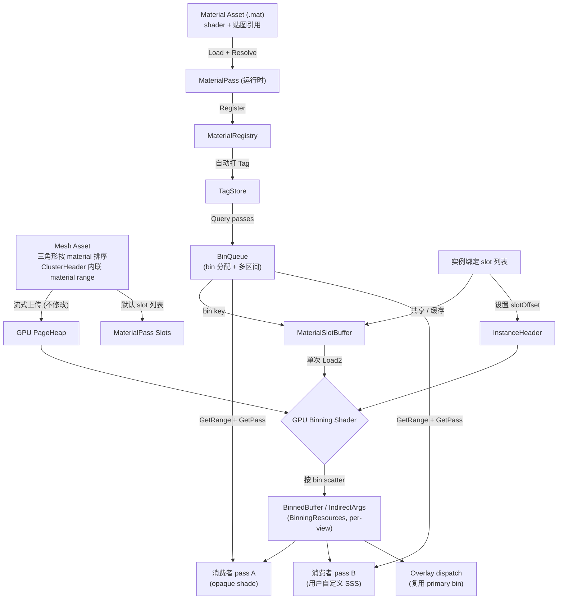

# Material System 重构架构设计 (v8)

## 设计原则

1. 参考 Nanite 的 `FNaniteMaterialSlot` 模式：**一个 MaterialSlot 包含所有 stage 的 bin key**，**单次间接查找**
2. Cluster / MeshAsset 侧只保存稳定的 **localMaterialIndex**，**不直接保存运行时 bin**
3. **Bin key 的语义是一次 dispatch / draw 可完整执行的工作单元**
4. **Stage 自决 bin 粒度**：只要 shader、固定状态或材质绑定集合不同，就必须分 bin
5. **MaterialPass 与管线解耦**：pass 只持有 `ShaderAsset` 引用，兼容性 Tag 由 Registry 根据 `ShaderAsset` 元数据自动打标
6. **Tag 在 Pass 上**：一个 pass 可有多个 tag（多切面），查询通过 `TagStore` 完成
7. **Pull 模型**：Stage 在 Setup 阶段主动查询相关 Tag 的 pass，不使用注册回调
8. Mesh 可以有一组默认 slot 绑定；实例默认共享，不强调独立的 "override" 概念
9. `localMaterialIndex < 128`（per-mesh-asset 局部上限，7 bit）
10. **Material 是唯一的材质资产**：MaterialPass 是纯运行时对象，不做资产化
11. **资产层规范化、运行时反规范化**：贴图在 Material 资产上定义，load 时 resolve 到 MaterialPass 的 ShaderParamBag 中

> [!NOTE]
> 本轮讨论后的定稿里，cluster 里原先叫 `MaterialID` 的东西，统一按 **localMaterialIndex** 理解。
> 它是 per-mesh-asset 的稳定索引，不是运行时材质句柄，也不是 bin key。
> Cluster 内的 localMaterialIndex 通过 ClusterHeader 内联的 material range（最多 3 段）查出。

---

## 核心概念

### 概念分层

```text
ClusterHeader.materialRanges (烘焙, 最多 3 range, per-cluster)
   │
   ├── GetLocalMaterialIndex(header, triangleID) → localMaterialIndex
   │
   ├── InstanceHeader.materialSlotOffset (per-instance, 上传时确定)
   │
   ▼
MaterialSlotBuffer[offset + localIndex] → MaterialSlot { RasterBin, ShadingBin, ... }
   │
   └── 一次 Load 得到所有 stage 的 bin key
```

### CPU 侧概念映射

```text
MeshAsset.DefaultSlots[localMaterialIndex] -> MaterialPass
Instance.Slots                         -> 默认共享 MeshAsset.DefaultSlots

TagStore<MaterialPass> (由 MaterialRegistry 封装, 只存语义分类 tag):
  registry.Query<ClusterShaderTag, OpaqueTag>()   -> [Pass]  // shade 查询
  registry.Query<ClusterShaderTag, MaskedTag>()   -> [Pass]  // masked 查询
  registry.Query<RefractionTag>()                 -> [Pass]

BinQueue (Feature 级, 存 bin 分配, 与 visibility 无关):
  binQueue.GetRange("opaque")      -> BinRange(start=0, count=3)
  binQueue.GetPass(binIndex)       -> MaterialPass

BinningResources (per-view, RG transient):
  BinnedBuffer, IndirectArgs — 每帧由 GPU binning pass 产出

MaterialSlotBuffer 填充时:
  遍历 slot 列表，从 BinQueue 读取各 stage 的 bin key
```

> [!NOTE]
> slot 的最小单位是一个 `MaterialPass`。
> `Material` 在资产层持有贴图引用和 pass 配置，运行时保留 source textures 用于 Instantiate / 热重载；dispatch 路径只读 `MaterialPass`。

### MaterialSlot — GPU 侧扁平结构

```csharp
[StructLayout(LayoutKind.Sequential, Size = 8)]
public struct MaterialSlot
{
    public ushort RasterBin;
    public ushort ShadingBin;
    public ushort ShadowBin;
    public ushort Padding;
}
```

**关键约束**：

- **Cluster 永远不存 bin**
- **同一个 bin 必须能一次 dispatch / draw 画完**
- **只要 shader、固定状态或材质绑定集合不同，就必须分 bin**
- **per-instance 动态数据不进入 bin 划分**

---

## ShaderAsset — 完整的 Shader 程序资产

Material shader 底层复用现有的预编译 `ShaderAsset`。每个 `MaterialPass` 通过 `ShaderAsset` 引用具体的、开箱即用的完整 Shader 程序，不再强依赖运行时的源文件链接。

为了兼顾不同习惯的开发流，用户提供"完整 Shader 逻辑"生成 `ShaderAsset` 的方式可以统一为以下三类：

### 1. 纯编辑器驱动

编辑器负责组合参与的 stage 入口，产出最终引用的 `ShaderAsset`。

### 2. 特性（Attribute）语法糖绑定

每个管线 Stage 提供唯一特性。Importer 扫描后，自动编译并生成完整 Shader 资产。

### 3. Stage 包装器逻辑

用户手写自己的 `[shader(...)]` 入口，再调用管线包装器做粘合，最终同样统一成 `ShaderAsset`。

**管线兼容性通过 Tag 标记**：

```csharp
public struct ClusterShaderTag : IMaterialTag { }
public struct ForwardShaderTag : IMaterialTag { }
```

> [!NOTE]
> `ShaderAsset` 未来仍需要补一层最小元数据，至少要能表达：
> 兼容哪些管线、有哪些语义 tag、用哪个入口点、以及材质绑定集合的稳定签名（绑定签名）。
> 反射数据用于：resolve 时确定 shader 需要哪些 Material 贴图、源生成器产出强类型 wrapper。

---

## 资产模型

### 资产类型

材质相关只有三种资产，使用 FlatBuffer 序列化：

| 资产 | 扩展名 | 内容 |
|------|--------|------|
| ShaderAsset | .shader | 编译后 shader 程序 + 反射元数据 |
| Material | .mat | shader 引用 + 贴图引用 + pass 配置 + 语义 tag |
| MaterialInstance | .matinst | parent Material 引用 + 参数覆盖 |

MaterialPass **不做资产化** — pass 模板本质上就是 ShaderAsset，不需要中间层。

### 资产索引

- 资产间引用使用 **UUID** 做规范引用，路径做辅助显示
- 每个源文件首次发现时分配 UUID，存在 `.meta` 或统一 manifest 中

### Material 资产结构

```flatbuffers
table MaterialAsset {
    name: string;
    passes: [PassEntry];
    textures: [TextureBinding];
}

table PassEntry {
    shader: string;         // ShaderAsset UUID
    tags: [TagEntry];       // 用户指定的语义 tag
}

table TextureBinding {
    name: string;           // param 名（如 "AlbedoMap"）
    asset: string;          // Texture UUID
}

table TagEntry {
    name: string;           // tag 序列化名（如 "opaque"）
    value: int = 0;         // 可选数据，覆盖 enum/int/bool
}
```

### MaterialInstance 资产

轻量资产，引用 parent Material + 参数覆盖。**加载时 resolve** 为具体 Material + MaterialPass 对象，运行时无级联。

```flatbuffers
table MaterialInstanceAsset {
    parent: string;                     // parent Material UUID
    overrides: [ParamOverride];
}

table ParamOverride {
    name: string;                       // 覆盖的贴图名
    asset_ref: string;                  // 新 Texture UUID
}
```

未覆盖的 pass 直接复用 parent 的 pass 实例（如 shadow pass 通常不受覆盖影响）。

### 运行时实例化 API

```csharp
Material variant = material.Instantiate();
variant.SetTexture("AlbedoMap", redSkinTexture);
registry.Register(variant);
```

---

## Material 与 MaterialPass

### Material — 资产层 + 运行时 source

`Material` 是美术的创作物，可序列化为 `.mat` 文件。去重靠资产缓存（同一 asset path → 同一对象）。

```csharp
public class Material : IDisposable
{
    public string Name { get; set; } = "";

    // 资产层的贴图引用（source of truth，用于 Instantiate / 热重载）
    internal ShaderParamBag SourceTextures;

    // resolve 后的运行时 pass（反规范化，用于 dispatch）
    private MaterialPass[] _resolvedPasses;
    public ReadOnlySpan<MaterialPass> Passes => _resolvedPasses;

    public Material Instantiate()
    {
        var clone = new Material();
        clone.SourceTextures = SourceTextures.Clone();
        // lazy resolve on next access
        return clone;
    }

    public void SetTexture(string name, ITextureView texture)
    {
        SourceTextures.Set(name, texture);
        InvalidateResolvedPasses();
    }
}
```

### MaterialPass — 纯运行时 dispatch 单元

`MaterialPass` 是运行时 slot 的最小单位。**不做资产化**，由 Material 加载时 resolve 产出。

核心职责：
- **存 shader 引用**：通过全局 shader 缓存（`IShader`）共用编译后的 shader 程序，不重复编译
- **存 resolved 的绑定参数**：ShaderParamBag 中包含该 shader 实际需要的贴图
- **ApplyToSRB**：把 bag 中的参数绑定到 SRB

```csharp
public class MaterialPass
{
    public ShaderAsset? Shader { get; set; }

    // resolve 后的绑定参数（从 Material.SourceTextures 取该 shader 需要的子集）
    internal readonly ShaderParamBag Params = new();

    public void ApplyToSRB(IShaderResourceBinding srb)
    {
        Params.ApplyTo(srb);
    }
}
```

> [!NOTE]
> ShaderParamBag 是动态容器（slot index 访问），可选强类型 wrapper 由源生成器从 shader 反射产出。
> 底层统一用 bag，序列化/签名/ApplyToSRB 全部统一。

### Resolve 流程

```text
Load "wood.mat" →
  1. 读取 passes[i].shader → 加载 ShaderAsset（含反射元数据）
  2. 读取 textures[] → 加载 Texture 资产
  3. 对每个 pass：
     a. 从 ShaderAsset 反射得知 shader 需要哪些参数（AlbedoMap, NormalMap...）
     b. 从 Material.textures 中取对应贴图
     c. 创建 MaterialPass { shader, bag={只含该 shader 需要的贴图} }
  4. 不需要该贴图的 pass（如 depth_only）→ bag 为空 → BinQueue 自然合并
```

### MaterialPass 数量频谱

MaterialPass 数量取决于 pass 类型的参数需求：

| pass 类型 | 用户参数 | 唯一 pass 数 | bin 数 |
|-----------|---------|-------------|--------|
| shadow（无用户输入） | 无 | N 个 Material 但 resolve 后 bag 完全相同 | **1**（签名相同，BinQueue 合并） |
| shade（每材质不同贴图） | albedo, normal, ARM 各不同 | N 个 Material，绑定各不同 | **N**（签名各异，无法合并） |
| 某些特效 pass | 部分参数相同 | N 个对象 | 介于 1 ~ N |

### Per-Instance 参数化

两层参数化机制：

| 层级 | 内容 | 影响 bin？ | 机制 |
|------|------|-----------|------|
| 材质级（贴图、shader） | albedo, normal | ✅ | MaterialPass bag / SRB |
| 实例级（tint、damage） | color, state | ❌ | per-instance GPU buffer，shader 按 instanceID 读取 |

---

## Tag 体系与查询

### Tag 只做语义分类

Tag 用于标注 MaterialPass 的语义属性（分类），marker 或最多带一个 int 值。**不用于存储 bin key**。

```csharp
// ── 语义分类 tag ──
[MaterialTag("opaque")]       public struct OpaqueTag : IMaterialTag { }
[MaterialTag("masked")]       public struct MaskedTag : IMaterialTag { }
[MaterialTag("translucent")]  public struct TranslucentTag : IMaterialTag { }
[MaterialTag("two_sided")]    public struct TwoSidedTag : IMaterialTag { }
[MaterialTag("shadow_caster")] public struct ShadowCasterTag : IMaterialTag { }

// ── 管线兼容性 tag（自动推导，不序列化） ──
public struct ClusterShaderTag : IMaterialTag { }
public struct ForwardShaderTag : IMaterialTag { }

// ── 多 pass tag（自动推导，不序列化） ──
public struct MultiPassTag : IMaterialTag { public byte OverlayCount; }
public struct OverlayTag : IMaterialTag { public byte LayerIndex; public MaterialPass PrimaryPass; }

// ── 用户自定义 tag ──
[MaterialTag("sss")]     public struct SSSTag : IMaterialTag { }
[MaterialTag("outline")] public struct OutlineTag : IMaterialTag { }
```

### Tag 反序列化

`[MaterialTag]` 特性 + 源生成器：扫描所有带特性的类型，生成静态 switch 映射 string → `registry.SetTag(pass, default(T))`。无反射、无字典。

| Tag 来源 | 序列化？ |
|----------|----------|
| 用户在 .mat 中指定 | ✅ 通过源生成器反序列化 |
| ShaderAsset 元数据自动推导 | ❌ 注册时自动打 |
| Material pass 结构自动推导 | ❌ 注册时自动打 |

### MaterialRegistry

`MaterialRegistry` 封装 `TagStore<MaterialPass>`。职责：

- 注册 / 注销 Material（自动 resolve pass + 打 tag）
- 对 pass 设置 / 查询语义 tag
- 提供多 tag 交集查询
- **不负责 bin 分配、不持有 PSO/SRB**

```csharp
public sealed class MaterialRegistry : IDisposable
{
    public void Register(Material material);
    public void Unregister(Material material);

    public void SetTag<TTag>(MaterialPass pass, TTag value = default) where TTag : struct;
    public TTag? GetTag<TTag>(MaterialPass pass) where TTag : struct;
    public bool HasTag<TTag>(MaterialPass pass) where TTag : struct;

    public ReadOnlySpan<MaterialPass> Query<T1>() where T1 : struct;
    public ReadOnlySpan<MaterialPass> Query<T1, T2>() where T1 : struct where T2 : struct;

    public uint Version { get; }  // 材质增删时递增
}
```

注册时自动推导 tag：

```csharp
public void Register(Material material)
{
    for (int i = 0; i < material.Passes.Length; i++)
    {
        var pass = material.Passes[i];
        // 1. 从 ShaderAsset 元数据打兼容性 tag
        // 2. 从 .mat 的 tags 字段反序列化语义 tag
        // 3. 从 pass 结构推导多 pass tag
        if (i == 0 && material.Passes.Length > 1)
            SetTag(pass, new MultiPassTag { OverlayCount = (byte)(material.Passes.Length - 1) });
        if (i > 0)
            SetTag(pass, new OverlayTag { LayerIndex = (byte)(i - 1), PrimaryPass = material.Passes[0] });
    }
}
```

---

## BinQueue — bin 级渲染队列

### 设计动机

`BinQueue` 是传统 RenderQueue 在 cluster 管线中的等价物。传统管线按 draw call 分队列，cluster 管线按 **bin（一批像素）** 分队列。

### BinQueue 与 BinningResources 分离

| | BinQueue | BinningResources |
|---|---|---|
| 内容 | pass → bin key 映射（CPU 侧） | BinnedBuffer, IndirectArgs（GPU 侧） |
| 更新频率 | 材质变更时（低频） | 每帧（visibility 变化） |
| 与 view 关系 | 无关 | per-view |
| 归属 | 定义 bin 空间的 Feature | RG transient pass（BinStage 产出） |

- **一个 BinQueue** 对应一个 bin 编号空间
- **一个 BinStage** 对应一次 GPU binning = 一份 BinningResources = 一个 view
- 同一 BinQueue 可对应多个 BinStage（主相机 + 各 shadow cascade）

### 接口

```csharp
public sealed class BinQueue
{
    public readonly struct BinRange
    {
        public readonly ushort Start;
        public readonly ushort Count;
    }

    // ── 声明（Setup 时一次性注册） ──
    public void RegisterRegionConfig(string name,
                                     Func<ReadOnlySpan<MaterialPass>> queryFunc,
                                     Func<MaterialPass, ulong> signatureFunc);

    // ── 构建（材质变更时，低频） ──
    public void Rebuild();

    // ── 查询 ──
    public int TotalBinCount { get; }
    public BinRange GetRange(string name);
    public MaterialPass GetPass(int binIndex);
    public ushort GetBinForPass(MaterialPass pass);
}
```

### Bin 签名与去重

签名函数 `Func<MaterialPass, ulong>` 返回一个 **hash 值**，由三部分组合：

```text
1. shader 程序身份（ShaderAsset 引用）
2. pass 的 ShaderParamBag 内容（具体绑定的贴图 handle）
3. 是否有 overlay pass（防止有/无 overlay 的同签名材质合并）
```

签名 hash 相同的 pass 归入同一个 bin。hash 冲突概率可忽略（64 bit），不做二次校验。

### 多区间示例

```csharp
// Setup 时注册 region（一次性）
binQueue.RegisterRegionConfig("opaque",
    () => registry.Query<ClusterShaderTag, OpaqueTag>(), ComputeSignature);
binQueue.RegisterRegionConfig("translucent",
    () => registry.Query<ClusterShaderTag, TranslucentTag>(), ComputeSignature);
binQueue.RegisterRegionConfig("masked",
    () => registry.Query<ClusterShaderTag, MaskedTag>(), ComputeSignature);

// Rebuild 时一次性构建所有 region
binQueue.Rebuild();
// bin 空间: [opaque bins...][translucent bins...][masked bins...]
// GPU binning 一次跑完所有 bin
// 各 dispatch pass 按 region 遍历
```

### 存储位置

BinQueue 放在**定义该 bin 空间的 Feature** 上。其他 Feature 通过 DI 注入拿到 owning Feature 引用，访问其 BinQueue 并注册自己的 region。

### Region 注册与 Rebuild 时机

**Region 注册**在 Feature.Setup()（一次性），只声明查询规则和签名函数，不做数据计算：

```csharp
// Feature.Setup() — 只跑一次
void Setup()
{
    _shadeBinQueue = new BinQueue();
    _shadeBinQueue.RegisterRegionConfig("opaque",
        queryFunc: () => registry.Query<ClusterShaderTag, OpaqueTag>(),
        signatureFunc: ComputeSignature);
    _shadeBinQueue.RegisterRegionConfig("translucent",
        queryFunc: () => registry.Query<ClusterShaderTag, TranslucentTag>(),
        signatureFunc: ComputeSignature);
}
```

**Bin Rebuild** 在 AddPasses 中通过 `MaterialRegistry.Version` 懒触发，只在材质增删时执行：

```csharp
// Feature.AddPasses() — 每帧
void AddPasses(RenderGraph graph)
{
    // O(1) 版本检查，大多数帧直接跳过
    if (registry.Version != _lastMaterialVersion)
    {
        _shadeBinQueue.Rebuild();
        _lastMaterialVersion = registry.Version;
        RebuildPSOsAndSRBs(); // Feature 内部方法：重建 _psoByBin[] + _srbByBin[] + _overlayEntries
    }

    // 正常添加 RG pass...
}
```

| 操作 | 频率 | 开销 |
|------|------|------|
| Region 注册 | 一次（Setup） | 零 |
| Version 检查 | 每帧 | O(1) |
| Bin Rebuild | 材质变更时 | O(passes)，万级 pass ≈ 1-2 ms |

---

## 多 Pass 渲染

### 核心机制：复用 primary bin 的 pixel/cluster list

多 pass（如 skin + stocking 叠加着色，或法线外扩描边）**不修改 MaterialSlot、不修改 GPU binning shader**。

overlay pass 复用 primary bin 的 BinnedBuffer + IndirectArgs，CPU dispatch 时换 PSO/SRB：

```csharp
// Primary dispatch: 皮肤着色
var skinRange = binQueue.GetRange("skin");
for (int bin = skinRange.Start; bin < skinRange.Start + skinRange.Count; bin++)
{
    ctx.SetPipelineState(psoByBin[bin]);
    srbByBin[bin].SetDynamic("BinnedBuffer", binRes.BinnedBuffer);
    ctx.CommitShaderResources(srbByBin[bin]);
    ctx.DispatchComputeIndirect(binRes.IndirectArgs, bin * 12);
}

// Overlay dispatch: 丝袜叠加（复用 primary bin 的 indirect args）
foreach (var (primaryBin, overlayPass) in overlayMapping)
{
    ctx.SetPipelineState(overlayPsoCache.Get(overlayPass));
    overlayPass.ApplyToSRB(overlaySrb);
    ctx.DispatchComputeIndirect(binRes.IndirectArgs, primaryBin * 12);
}
```

### 光栅化多 pass

与 shade 多 pass 相同模式：outline raster dispatch 复用 primary bin 的 visible cluster list，换 PSO（法线外扩 vertex shader）。共享 culling/LOD/BVH 结果。

### Overlay 关系通过 Tag

- `MultiPassTag`（primary pass 上）：标记有 overlay
- `OverlayTag`（overlay pass 上）：含 `LayerIndex` + `PrimaryPass` 引用
- 注册时自动推导
- dispatch 顺序按 LayerIndex
- compute 路径 blend 由 shader 内部处理；raster 路径 blend state 通过 tag 指定

### Overlay Mapping 构建

Feature 内部维护 `overlayMapping`，在 `RebuildPSOsAndSRBs()` 中（即 BinQueue.Rebuild 之后）构建：

```csharp
struct OverlayEntry
{
    public ushort PrimaryBin;
    public MaterialPass OverlayPass;
    public byte LayerIndex;
}

// Feature 上持久存储，随 bin rebuild 重建
private readonly List<OverlayEntry> _overlayEntries = new();

void RebuildOverlayMapping()
{
    _overlayEntries.Clear();
    foreach (var overlay in registry.Query<OverlayTag>())
    {
        var tag = registry.GetTag<OverlayTag>(overlay);
        if (tag is not { } t) continue;
        var primaryBin = _binQueue.GetBinForPass(t.PrimaryPass);
        _overlayEntries.Add(new OverlayEntry
        {
            PrimaryBin = primaryBin,
            OverlayPass = overlay,
            LayerIndex = t.LayerIndex,
        });
    }
    _overlayEntries.Sort((a, b) =>
        a.PrimaryBin != b.PrimaryBin
            ? a.PrimaryBin.CompareTo(b.PrimaryBin)
            : a.LayerIndex.CompareTo(b.LayerIndex));
}
```

dispatch 时顺序遍历 `_overlayEntries`，primaryBin 相同的连续条目对应同一组 overlay layers。

---

## Stage 侧：Pull 查询 + PSO/SRB 管理

### 职责分离

| 概念 | 职责 | 归属 |
|------|------|------|
| `TagStore` | 存语义分类 tag，支持交集查询 | `MaterialRegistry` 封装 |
| `BinQueue` | 对一组 pass 做 bin 分组 + 编号 | Feature 上的持久对象 |
| `BinningResources` | per-view GPU binning 产出 | RG transient pass |
| PSO 缓存 | per-bin GPU 资源管理 | 各消费者 Feature 自己持有 |
| SRB 缓存 | per-bin GPU 资源管理 | 各消费者 Feature 自己持有 |

### PSO 管理

| Pass 类型 | PSO 归属 |
|-----------|----------|
| 固定 shader pass（binning、depth） | Pass 类的 **static 字段**，创建一次永不变 |
| 材质驱动 pass（shade dispatch） | Feature 上的 `Dictionary<ShaderAsset, PSO>` + `_psoByBin[]` |

- 提供可选**全局 PSO cache manager** 用于去重，不强制使用
- Feature 或 Pass 可自行创建和管理 PSO

### SRB 管理

- SRB 缓存在 Feature 上，per-bin 索引
- per-view 变化的绑定（BinnedBuffer、CameraBuffer）声明为 DYNAMIC 变量 → SRB 数量 = bins（非 bins × views）
- 跨 Feature **不共享** SRB — 解耦 > 内存节省

### Stage Function 架构

- Stage 是**静态函数**（可组合积木块），不是 Feature 方法
- 状态（BinQueue、PSO cache、SRB cache）在用户 Feature 上，通过参数传给 stage function
- Stage function 隐藏内部 RG handle 传递

### Feature 发现

- 通过现有 **DI 基础设施**注册/注入
- 多实例需求由 Feature 内部管理，对外保持单例接口

---

## Cluster 多材质支持

### ClusterHeader 内联 material range

Cluster 支持最多 **3 个 material range**（Nanite fast path）。三角形在 cluster 内按 material 排序（build 时）。

```text
ClusterHeader {
    // ... existing fields ...
    uint matID0 : 7;    // material slot index 0
    uint matID1 : 7;    // material slot index 1
    uint matID2 : 7;    // material slot index 2
    uint range0End : 7; // tri[0..range0End) → matID0
    uint range1End : 7; // tri[range0End..range1End) → matID1
                         // tri[range1End..total) → matID2
}
```

存储 ≈ 5 bytes，查找 ≈ 2 次比较：

```hlsl
uint GetLocalMaterialIndex(ClusterHeader header, uint triIdx) {
    if (triIdx < header.range0End) return header.matID0;
    if (triIdx < header.range1End) return header.matID1;
    return header.matID2;
}
```

- **硬限 3 range**，不做 slow path 外部查表
- Build 时超过 3 个 material 的 cluster → 拆分为多个 cluster
- `localMaterialIndex < 128` 约束不变（per-mesh-asset，7 bit 上限）

### Mesh 简化中的材质边界

- **加权 QEM 软约束**（不硬锁），避免密度岛 artifact
- `total_error(edge) = geometric_error(edge) + K × material_discontinuity(edge)`
- 精细 LOD：边界保持锐利；粗 LOD：边界允许偏移
- 折叠后材质归属由面积主导方决定
- K 值按边界视觉重要性分级（不同 shader > 同 shader 不同贴图 > 纯参数差异）

---

## Mesh 资产 ID 与流式上传

### 预分配与间接查找

Cluster 内三角形按 material 排序，通过 ClusterHeader 的 material range 查出 `localMaterialIndex`。

每个 instance 的 `InstanceHeader` 携带 `materialSlotOffset`：

```hlsl
struct InstanceHeader {
    // ... existing fields ...
    uint materialSlotOffset;
};
```

### GPU 查找路径（单次间接）

```hlsl
uint triIdx = visBuffer.triangleID;
uint localIdx = GetLocalMaterialIndex(clusterHeader, triIdx);
uint offset = instanceHeaders[cluster.instanceID].materialSlotOffset;
MaterialSlot slot = MaterialSlotBuffer[offset + localIdx];

uint rasterBin = slot.RasterBin;
uint shadingBin = slot.ShadingBin;
```

一次 buffer read（一个 `uint2`）+ 2 次比较（material range），无分支，O(1)。

### MaterialSlotBuffer 填充

MaterialSlot 的各字段由**拥有对应 BinQueue 的 Feature** 各自填写。每个 Feature 只填自己负责的字段：

```csharp
// ShadeFeature 拥有 _shadeBinQueue，负责填 ShadingBin
public void FillShadingBins(Span<MaterialSlot> slots, ReadOnlySpan<MaterialPass> passes)
{
    for (int i = 0; i < passes.Length; i++)
        slots[i].ShadingBin = _shadeBinQueue.GetBinForPass(passes[i]);
}

// ShadowFeature 拥有 _shadowBinQueue，负责填 ShadowBin
public void FillShadowBins(Span<MaterialSlot> slots, ReadOnlySpan<MaterialPass> passes)
{
    for (int i = 0; i < passes.Length; i++)
        slots[i].ShadowBin = _shadowBinQueue.GetBinForPass(passes[i]);
}
```

空间分配仍统一由 `MaterialSlotBuffer.AllocateRange()` 管理，各 Feature 在 bin rebuild 后 patch 自己的字段。

### 实例 Slot 共享与缓存

- 相同材质组合的 instance 共享同一段 MaterialSlotBuffer（hash + refcount）
- bin rebuild 后只 patch 受影响的共享 slot 表的 bin key 值
- 空间管理使用 FreeList 分配器

---

## Binning 算法（动态 bin 数）

```text
Pass 0: Init    — 清零 BinMeta[0..binCount]
Pass 1: Count   — GPU 遍历 visible clusters / pixels, atomic 统计每 bin 数量
Pass 2: Reserve — 前缀和 → 确定每 bin offset, 写 indirect args
Pass 3: Scatter — 再次遍历, 按 offset + atomic_add 写入 BinnedBuffer
CPU:    Per-bin dispatch — 遍历 active bins, set PSO/SRB, indirect draw/dispatch
```

当前第一版仍可保留快路径：

- `activeBins < 65536`：ushort 上限
- 后续再去掉固定上限，切到完全动态

---

## CPU 端：Per-Bin Dispatch

```csharp
var range = binQueue.GetRange("opaque");
for (int bin = range.Start; bin < range.Start + range.Count; bin++)
{
    var pso = feature.GetPSO(bin);
    if (pso == null) continue;
    srbByBin[bin].SetDynamic("BinnedBuffer", binRes.BinnedBuffer);
    ctx.SetPipelineState(pso);
    ctx.CommitShaderResources(srbByBin[bin]);
    ctx.DispatchComputeIndirect(binRes.IndirectArgs, bin * 12);
}
```

关键不是"按材质 dispatch"，而是 **按 bin dispatch**。Overlay pass 复用 primary bin 的 indirect args，换 PSO/SRB 重新发射。

---

## 整体数据流



### 数据流文字描述

```text
1. 美术创建 Material (.mat) → 内含 shader 引用 + 贴图引用
2. 加载时 resolve: ShaderAsset 反射 + Material 贴图 → 创建运行时 MaterialPass
3. 注册: registry.Register(material) → TagStore 存入 pass + 自动打 tag
4. Feature.Init() → 创建 BinQueue, MaterialSlotBuffer
5. 材质变更时:
     binQueue.Rebuild(registry.Query<...>(), signatureFunc)  // bin 分配
     slotCache.PatchAfterBinRebuild(binQueue)                // 填充 GPU buffer
     slotBuffer.Upload(gpu)
6. 每帧 AddPasses:
     GPU binning pass (读 slotBuffer → 产出 BinningResources)
     消费者 pass A (遍历 binQueue region → per-bin dispatch, 自己的 PSO/SRB)
     消费者 pass B (复用 binning 结果 + 同一 binQueue, 自己的 PSO/SRB)
     Overlay dispatch (复用 primary bin 的 IndirectArgs, 换 PSO/SRB)
```

---

## 与现有代码的关系

| 现有概念 | 新概念 | 变化 |
|---------|--------|------|
| `MaterialBase` | `Material` + `MaterialPass` | Material 是资产/source，MaterialPass 是 resolve 后的运行时对象 |
| `MaterialShaderType` + `IPassKey` | 逐步淡出 | Stage 自行管 PSO 和 bin |
| `MaterialRegistry` | 封装 `TagStore<MaterialPass>` | 注册/ID + Tag 操作 + 查询 + 自动 resolve |
| `MaterialTagSet` | 逐步迁移到 `TagStore` + 源生成器反序列化 | |
| `SlangStructName` (string) | `ShaderAsset`（现有） | 继续复用已有预编译资产类 |
| `ClusterBinningPass` | shader 从 `MaterialSlotBuffer` 读 bin key + material range 查找 | GPU 改 |
| `ClusterMaterialShadePass` | 按 `ShadingBin` 分 dispatch + `_psoByBin[]` 索引 | CPU 改 |
| `GpuInstanceHeader.MaterialID` | `materialSlotOffset` | cluster 侧改用 material range |
| Mesh 单材质 | Mesh 默认 slot 列表 + cluster 内联 material range | 资产链路改 |

### 当前还未落地的代码前提

- `MeshAsset` schema 目前还没有默认 slot 列表
- `ClusterBuilder` 当前只处理 `mesh.Primitives[0]`
- `ShaderAsset` 还没有表达兼容管线 / 语义 tag / 绑定签名 / 反射元数据 的最小元数据
- `ClusterHeader` 还没有 material range 字段

---

## 分阶段实施

### Phase 1

先统一语义和命名：

- `MaterialID` 在 cluster 语境下改按 `localMaterialIndex` 理解
- 一个 slot = 一个 `MaterialPass`
- Mesh 默认 slot 列表，实例默认共享

### Phase 2

先改 CPU 侧：

- `Material`（资产层 + 运行时 source）
- `MaterialPass`（运行时，ShaderParamBag）
- `MaterialRegistry`（TagStore + 自动 tag 推导 + resolve）
- `MaterialInstance` 支持
- Tag 序列化（源生成器）
- ShaderAsset 反射元数据（FlatBuffer schema）
- Stage Pull 查询

先不动 GPU 查找路径。

### Phase 3

再改资产链路：

- .mat FlatBuffer schema 实现
- .matinst FlatBuffer schema 实现
- MeshAsset 默认 slot 列表
- cluster 烘焙 material range（三角形排序 + 内联 3 range）
- 实例 slot 列表与共享缓存（hash + refcount + FreeList）

### Phase 4

最后切 GPU 路径：

- `materialSlotOffset`
- `MaterialSlotBuffer`
- ClusterHeader material range 查找替代 `localMaterialIndex` 直接读取
- raster / shade binning 改为从 slot 读 bin
- CPU 按 bin dispatch + overlay dispatch

### Phase 5

最后补：

- 增量 patch（MaterialSlotBuffer bin key 变更时只 patch 受影响的 slot）
- 动态 bin 数
- 更完整的 `ShaderAsset` 元数据
- 全局 PSO cache manager
- 资产 UUID manifest 系统（需独立梳理全部资产类型）
