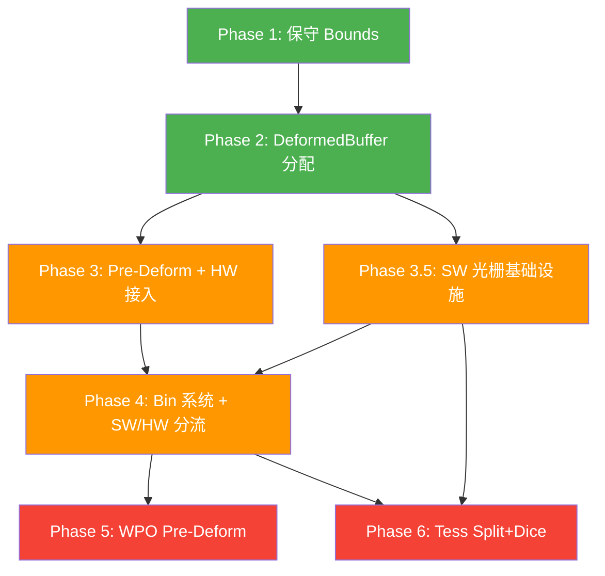

# 预计算变形 Cluster 管线 — 详细实施方案

基于 [raster.md](file:///f:/SomeEngine/docs/raster.md) 的架构计划，结合现有代码分析后的逐阶段实施细节。

## 现有架构概览

当前管线为**纯静态不透明几何**，仅有 **HW 光栅化**路径：

```
BVH Traverse → Candidate → 2-Phase HiZ Cull → VisibleClusters → HW Rasterize (VS/PS) → VisBuffer → CS Resolve → Color
```

核心文件：
- 编排：[ClusterRenderFeature.cs](file:///f:/SomeEngine/src/SomeEngine.Render/Pipelines/ClusterRender/ClusterRenderFeature.cs) （~1400行）
- 剔除：[ClusterCullPass.cs](file:///f:/SomeEngine/src/SomeEngine.Render/Pipelines/ClusterRender/ClusterCullPass.cs) + [cluster_cull.slang](file:///f:/SomeEngine/assets/Shaders/cluster_cull.slang)
- 光栅：[ClusterDrawPass.cs](file:///f:/SomeEngine/src/SomeEngine.Render/Pipelines/ClusterRender/ClusterDrawPass.cs) + [cluster_draw.slang](file:///f:/SomeEngine/assets/Shaders/cluster_draw.slang)
- 解析：[ClusterResolvePass.cs](file:///f:/SomeEngine/src/SomeEngine.Render/Pipelines/ClusterRender/ClusterResolvePass.cs) + [cluster_resolve.slang](file:///f:/SomeEngine/assets/Shaders/cluster_resolve.slang)
- 数据：[GPUCluster.cs](file:///f:/SomeEngine/src/SomeEngine.Assets/Data/GPUCluster.cs) (48B)、[GpuInstanceHeader](file:///f:/SomeEngine/src/SomeEngine.Render/Data/InstanceMetadata.cs) (16B)

## User Review Required

> [!IMPORTANT]
> **Phase 1-3 形成最小可用闭环**（保守 Bounds + DeformedBuffer + 骨骼蒙皮 + HW 光栅读取 DeformedBuffer），建议先实施 Phase 1-3 验证。  
> **Phase 3.5（SW 光栅基础设施）可与 Phase 3 并行开发**，两者共享 DeformedBuffer 但互不依赖。

> [!WARNING]
> **Phase 4（复合 Bin 系统）统一 SW/HW 分流**，是 WPO/Tess/Masked 等可编程光栅化的前置。如短期只需蒙皮，可先硬编码路径，但 Bin 系统的数据结构需从一开始预留。

> [!CAUTION]
> **Phase 6（Tessellation）** 的 Dice 阶段**必须**走软光栅（微三角形无法 DrawIndirect），因此 Phase 3.5 是 Phase 6 的硬性前置。

---

## Phase 1：保守 Bounds 剔除（★★）

**目标**：可变形 Instance 在 BVH 遍历和 Cluster 剔除时使用扩展后的 AABB，避免被错误裁剪。

### 数据结构变更

#### [MODIFY] [GpuInstanceHeader](file:///f:/SomeEngine/src/SomeEngine.Render/Data/InstanceMetadata.cs)
```diff
 public struct GpuInstanceHeader
 {
     public uint BVHRootIndex;
     public uint MaterialID;
     public uint MetadataOffset;
     public uint MetadataCount;
+    public uint DeformFlags;      // bit0: Skinned, bit1: WPO, bit2: Tessellation
+    public float BoundsExpansion;  // 保守扩展量（世界空间单位）
+    public uint BoneMatrixOffset;  // BoneBuffer 中的起始偏移
+    public uint BoneCount;        // 骨骼数量
 }
```

#### [MODIFY] [cluster_structures.slang](file:///f:/SomeEngine/assets/Shaders/cluster_structures.slang)
- GPU 端 `GpuInstanceHeader` 同步增加上述字段

### 剔除 Shader 变更

#### [MODIFY] [cluster_cull.slang](file:///f:/SomeEngine/assets/Shaders/cluster_cull.slang)
- 对 `DeformFlags != 0` 的 Cluster：
  - `aabb.Min -= BoundsExpansion`，`aabb.Max += BoundsExpansion`
  - LOD 球体半径同步扩展

### C# 端变更

#### [MODIFY] [InstanceSyncSystem.cs](file:///f:/SomeEngine/src/SomeEngine.Render/Systems/InstanceSyncSystem.cs)
- 上传时填充 `DeformFlags`、`BoundsExpansion`

### 依赖
- 无前置依赖

---

## Phase 2：TransientDeformedBuffer 原子分配 + 压缩编码（★★★）

**目标**：Cull 阶段为存活的可变形 Cluster 原子分配顶点存储空间。

### 新增数据结构

#### [NEW] `src/SomeEngine.Render/Data/DeformedBufferStructs.cs`
```csharp
[StructLayout(LayoutKind.Sequential)]
public struct DeformedClusterAlloc
{
    public uint PositionOffset;  // DeformedPositionBuffer 中的字节偏移
    public uint NormalOffset;    // DeformedNormalBuffer 中的字节偏移
}
```

### Buffer 布局

| Buffer | 格式 | 大小 |
|--------|------|------|
| `DeformedPositionBuffer` | uint16×3 (6B/v) | `MaxDeformedVertices × 6` |
| `DeformedNormalBuffer` | Oct SNORM16 + TangentSign (6B/v) | `MaxDeformedVertices × 6` |
| `DeformedAllocCounter` | R32_UINT | 4B |
| `DeformedClusterAllocTable` | Structured | `MaxVisibleClusters × 8B` |

### Shader / C# 变更
- [cluster_cull.slang](file:///f:/SomeEngine/assets/Shaders/cluster_cull.slang)：`AppendVisible` 时对 `DeformFlags != 0` 的 Cluster 做 `InterlockedAdd` 分配
- [ClusterRenderFeature.cs](file:///f:/SomeEngine/src/SomeEngine.Render/Pipelines/ClusterRender/ClusterRenderFeature.cs)：创建上述 Buffer

### 依赖
- Phase 1（`DeformFlags`）

---

## Phase 3：Pre-Deform CS（骨骼蒙皮）+ HW Rasterize/Resolve 接入（★★★★）

**目标**：Pre-Deform CS 输出变换后顶点到 DeformedBuffer；**现有 HW 光栅路径**从 DeformedBuffer 读取。

### 新增 Shader

#### [NEW] `assets/Shaders/cluster_pre_deform.slang`

```hlsl
[numthreads(128, 1, 1)]  // 128 = max vertex count per cluster
void CSPreDeform(uint3 dtid : SV_DispatchThreadID, uint3 gid : SV_GroupID)
{
    // 1. 跳过静态 Cluster (alloc.PositionOffset == 0xFFFFFFFF)
    // 2. 从 PageHeap 读原始顶点 + Skin Weights
    // 3. LBS 蒙皮
    // 4. WaveActiveMin/Max 求 Cluster AABB → 量化为 uint16×3
    // 5. 写入 DeformedPositionBuffer / DeformedNormalBuffer
}
```

### 新增 C# Pass

#### [NEW] `src/SomeEngine.Render/Pipelines/ClusterRender/ClusterPreDeformPass.cs`
#### [NEW] `src/SomeEngine.Render/Systems/BoneBufferManager.cs` — 管理 `BoneMatrixBuffer`

### 现有 HW 路径修改

#### [MODIFY] [cluster_draw.slang](file:///f:/SomeEngine/assets/Shaders/cluster_draw.slang)
- VS 判断 `DeformedClusterAllocTable[idx].PositionOffset != 0xFFFFFFFF`
  - 是 → 从 `DeformedPositionBuffer` 读
  - 否 → PageHeap（不变）

#### [MODIFY] [cluster_resolve.slang](file:///f:/SomeEngine/assets/Shaders/cluster_resolve.slang)
- 同理适配 `FetchVertexPosition` / `FetchVertexNormal`

### Skin Weights 存储

> [!IMPORTANT]
> 当前 PageHeap 无蒙皮数据。建议将 `SkinWeights + BoneIndices` 编码进 PageHeap 新流（asset import 阶段写入），使同一 Mesh Page 可被多 Instance 共享。

### 依赖
- Phase 2

---

## Phase 3.5：软光栅基础设施（★★★★）

**目标**：实现 CS 软光栅器核心，直接通过 Compute Shader 将三角形写入 VisBuffer（`RWTexture2D<uint>`），为 Masked/PDO/Tess 等可编程路径打基础。

### 为什么需要软光栅

| 场景 | HW 光栅 | SW 光栅 |
|------|---------|---------|
| **纯不透明静态** | ✅ 最优（固定管线加速） | ❌ 不需要 |
| **Masked / Alpha Test** | ⚠️ 需要 PS discard，打断 Early-Z | ✅ CS 中采样纹理 → 条件写入 |
| **PDO（Pixel Depth Offset）** | ⚠️ 需要修改深度输出，更慢 | ✅ CS 直接计算偏移深度 |
| **Tessellation Dice** | ❌ 微三角形无固定 128-tri/cluster 结构，无法 DrawIndirect | ✅ 必须走 CS |
| **小三角形（<2px）** | ❌ quad overshading 严重 | ✅ 逐像素扫描，无浪费 |
| **WPO** | ⚠️ 可走 HW 但需变体 | ✅ 变形后顶点已在 DeformedBuffer |
| **Two-Sided** | ⚠️ 需要禁用背面剔除 | ✅ CS 中 skip backface cull |

> [!TIP]
> Nanite 的经验：同一个 RasterBin 内的 Cluster 按屏幕面积分流——**小 Cluster（<N px²）走 SW**，**大 Cluster 走 HW**。我们在 Phase 4 Bin 系统中实现这个分流。Phase 3.5 先独立实现 SW 光栅核心。

### 软光栅核心架构

```
1 Group = 1 Cluster (64 threads)
    │
    ├── Stage 1: Vertex Transform (读 DeformedBuffer 或 PageHeap)
    │   └── 结果存 groupshared float3 GroupVerts[256]
    │
    ├── Stage 2: Triangle Setup (每线程处理 ≤2 个三角形)
    │   ├── 反量化 → Clip Space → Subpixel (8x8 子像素精度)
    │   ├── 背面剔除 (可选 Two-Sided skip)
    │   └── 输出 FRasterTri { 边方程, Bounding Box }
    │
    └── Stage 3: Scanline Rasterize (自适应策略)
        ├── 微三角形 (≤2px): 逐像素测试
        ├── 中三角形: 扫描线 (edge function evaluation)
        ├── 大三角形: 分块写入
        └── 深度测试 + 原子写入 VisBuffer
            InterlockedMax(VisBuffer[pixel], (depth << 7) | triangleID)
            或
            InterlockedMax(Depth64[pixel], pack(depth, visData))
```

### VisBuffer 原子写入策略

当前 HW 路径用硬件深度测试，SW 路径需要自行实现。两种方案：

**方案 A：单 `RWTexture2D<uint>` (32-bit)**
```hlsl
// VisBuffer 编码: (VisibleClusterIndex+1) << 7 | TriangleID
// 深度测试: 单独的 RWTexture2D<uint> DepthUint 存 floatBitsToUint(depth)
// 两次原子操作: 先 InterlockedMin(DepthUint, depthBits), 再有条件写 VisBuffer
```
- 优点：与现有 HW 路径共享 VisBuffer 格式
- 缺点：两次原子操作有竞争窗口

**方案 B：`RWTexture2D<uint64>` 打包 (推荐)**
```hlsl
// 64-bit: [Depth:32][VisData:32]
// 单次 InterlockedMax 保证原子性
// 最终拆分: VisBuffer = lower 32 bits, Depth = upper 32 bits
```
- 优点：单原子操作，无竞争
- 缺点：需要 64-bit atomic 支持（D3D12 Shader Model 6.6 / Vulkan atomicUint64）

> [!IMPORTANT]
> **建议先用方案 A**（32-bit 双缓冲），兼容性最好。64-bit atomic 作为可选优化路径。

### 新增文件

#### [NEW] `assets/Shaders/cluster_sw_raster.slang` — 软光栅核心

```hlsl
// 子像素精度常量
static const uint SUBPIXEL_BITS = 8;
static const uint SUBPIXEL_SAMPLES = 1 << SUBPIXEL_BITS;

groupshared float3 GroupVerts[256];  // 顶点缓存

struct FRasterTri
{
    int2  MinPixel, MaxPixel;   // 像素级 Bounding Box
    float3 Edge0, Edge1, Edge2; // 边方程 (A,B,C) for Ax+By+C >= 0
    float  InvArea;             // 1/2倍面积（用于重心坐标）
    bool   bIsValid;
};

FRasterTri SetupTriangle(int4 scissor, float4 v0_sub, float4 v1_sub, float4 v2_sub, bool cullBackface)
{
    // 子像素坐标三角形设置
    // 计算边方程、背面剔除、Bounding Box 裁剪
    ...
}

void RasterizeTriangle(FRasterTri tri, uint pixelValue, float3 depths,
                       RWTexture2D<uint> outVisBuffer, RWTexture2D<uint> outDepth)
{
    // 自适应扫描：小三角形逐像素，中三角形扫描线
    for (int y = tri.MinPixel.y; y <= tri.MaxPixel.y; y++)
    for (int x = tri.MinPixel.x; x <= tri.MaxPixel.x; x++)
    {
        // Edge function 测试 → 重心坐标 → 插值深度
        // InterlockedMin(outDepth[xy], depthBits) → 有条件写 outVisBuffer
    }
}

[numthreads(64, 1, 1)]
void CSSWRaster(uint3 gid : SV_GroupID, uint tid : SV_GroupThreadIndex)
{
    // 1. 从 BinnedClusterBuffer 读取本 Group 对应的 Cluster
    // 2. Vertex Transform → GroupVerts[]
    // 3. GroupMemoryBarrierWithGroupSync()
    // 4. 每线程负责 ceil(triCount/64) 个三角形
    //    SetupTriangle → RasterizeTriangle
}
```

#### [NEW] `src/SomeEngine.Render/Pipelines/ClusterRender/ClusterSWRasterPass.cs`

```csharp
// Compute Pass，DispatchIndirect 基于 SW Bin 的 Cluster 数量
// 绑定: VisibleClusters, PageHeap, DeformedBuffers, VisBuffer(UAV), DepthUAV
```

### 与 HW 路径共存

SW 和 HW 路径写入**同一个 VisBuffer**——两者的 VisBuffer 编码完全一致：`(VisibleClusterIndex+1) << 7 | TriangleID`。

```
Phase1 Cull → (Phase 3.5 开始生效后)
├── HW Draw (大 Cluster, 不透明) → VisBuffer + HW Depth
├── SW Raster CS (小 Cluster / Masked / PDO) → VisBuffer + SW DepthUAV
│   └── 需要 Copy SW DepthUAV → HW Depth (或 Max merge)
└── Resolve CS 统一读 VisBuffer
```

> [!WARNING]
> **HW Depth Buffer 和 SW DepthUAV 的合并**是关键细节。Nanite 用 64-bit atomic 在 UAV 上做所有深度测试，完全绕开 HW Depth。我们可以：
> 1. **Phase 3.5 初期**：纯 SW 路径使用独立 `DepthUAV`，渲染完后 copy 到 HW Depth 供 HiZ 使用
> 2. **Phase 4 后**：统一用 UAV Depth（完全放弃 HW Depth），HW 路径也写 UAV

### 依赖
- Phase 2（DeformedBuffer）— 如果只测试静态 Cluster 的 SW 路径，可与 Phase 2 并行
- **不依赖 Phase 3**（可独立用静态 Cluster 测试）
- Phase 4（Bin 系统）提供 SW/HW 分流后才真正投入生产

---

## Phase 4：复合 Bin 系统 + SW/HW 分流（★★★）

**目标**：按 `(DeformType, RasterType, MaterialID)` 分 Bin，每个 Bin 内再按 **屏幕面积阈值** 分 SW/HW 子集。

### Bin Key 设计

```
BinKey = (DeformType : 2) | (RasterType : 3) | (MaterialID : 16)
```

- DeformType: `0=Static, 1=Skinned, 2=WPO`
- RasterType: `0=Opaque, 1=Masked, 2=TwoSided, 3=PDO, 4=Tess+Disp`

### Bin 元数据（参考 Nanite `FNaniteRasterBinMeta`）

```hlsl
struct RasterBinMeta
{
    uint ClusterOffset;     // BinnedClusterBuffer 中的起始偏移
    uint BinSWCount;        // SW 路径 Cluster 数量
    uint BinHWCount;        // HW 路径 Cluster 数量
    uint MaterialFlags;     // Masked / TwoSided / PDO 等标志
};
```

### SW/HW 分流策略

在 Binning CS 中，对每个 Cluster 估算屏幕面积（已有 Cull 阶段的 Bounding Sphere 投影数据）：

```hlsl
float screenArea = EstimateClusterScreenArea(cluster, view);
bool useSW = (screenArea < SW_THRESHOLD_PIXELS)  // 小 Cluster
          || (binMeta.MaterialFlags & RASTER_FLAG_MASKED)  // Masked 必须 SW
          || (binMeta.MaterialFlags & RASTER_FLAG_PDO)     // PDO 必须 SW
          || (binMeta.MaterialFlags & RASTER_FLAG_TESS);   // Tess 必须 SW
```

- SW Cluster 写入 BinnedClusterBuffer **从头部开始**
- HW Cluster 写入 BinnedClusterBuffer **从尾部开始**
- 与 Nanite 完全一致的双端写入策略

### 管线编排

```
Cull → Binning CS → 
  for each Bin:
    Pre-Deform CS (if DeformType != Static)
    → UAV Barrier
    → SW Raster CS (dispatch BinSWCount groups)
    → HW Draw (DrawIndirect BinHWCount instances)
  → Depth Merge (SW DepthUAV → HW Depth, if needed)
  → HiZ Build → Phase 2 Cull → ...
  → Resolve
```

### 新增文件

#### [NEW] `assets/Shaders/cluster_binning.slang`
#### [NEW] `src/SomeEngine.Render/Pipelines/ClusterRender/ClusterBinningPass.cs`

### 依赖
- Phase 1-3（基础路径）
- Phase 3.5（SW 光栅核心）

---

## Phase 5：WPO 材质 Pre-Deform 支持（★★★★）

**目标**：per-material 的 WPO Pre-Deform CS。

- 需要材质系统的 Slang 代码生成 / permutation 机制
- Bin 系统按 `(WPO, MaterialID)` 分组
- 每组 Dispatch 对应材质的 Pre-Deform CS 变体

#### [NEW] `src/SomeEngine.Render/Systems/PreDeformPermutationManager.cs`

### 依赖
- Phase 4（Bin 系统）+ 材质系统

---

## Phase 6：Tessellation/Displacement 光栅化路径（★★★★★）

**目标**：Split→Dice 流式**软光栅化**（Phase 3.5 的 SW Raster 是硬性前置）。

### 架构

```
Cluster Triangles
    ↓ per-triangle TessFactor 估算
Split CS → VisiblePatches buffer
    ↓
Dice CS (直接调用 SW Raster 核心) → VisBuffer
```

- **Dice 阶段复用 Phase 3.5 的 `RasterizeTriangle`**
- Split 查表保证水密拓扑
- 微三角形 VisBuffer 编码需独立方案（Patch + MicroTriID）

### 新增文件

#### [NEW] `assets/Shaders/cluster_split.slang`
#### [NEW] `assets/Shaders/cluster_dice.slang`
#### [NEW] `assets/Shaders/cluster_tess_tables.slang`
#### [NEW] `src/SomeEngine.Render/Pipelines/ClusterRender/ClusterTessSplitPass.cs`
#### [NEW] `src/SomeEngine.Render/Pipelines/ClusterRender/ClusterTessDicePass.cs`

### 依赖
- Phase 3.5（SW 光栅核心）
- Phase 4（Bin 系统，Tess 作为独立 RasterBin）
- 材质系统

---

## 阶段间依赖关系



## 验证计划

### Phase 1-2 验证
- 单元测试验证 AABB 扩展和原子分配计数
- Debug AABB 可视化确认 Bounds 膨胀

### Phase 3 验证
- T-Pose 蒙皮 Mesh（骨骼为单位矩阵）应与静态 Mesh 像素级一致
- 骨骼动画播放视觉确认

### Phase 3.5 验证
- **关键基准测试**：同一静态场景分别走 HW only / SW only / 混合，对比 VisBuffer 像素级一致性
- 性能对比：小三角形密集场景 SW 应优于 HW

### Phase 4 验证
- 验证 Bin 分流后 SW+HW 混合渲染结果与纯 HW 一致
- 检查 Depth Merge 正确性
