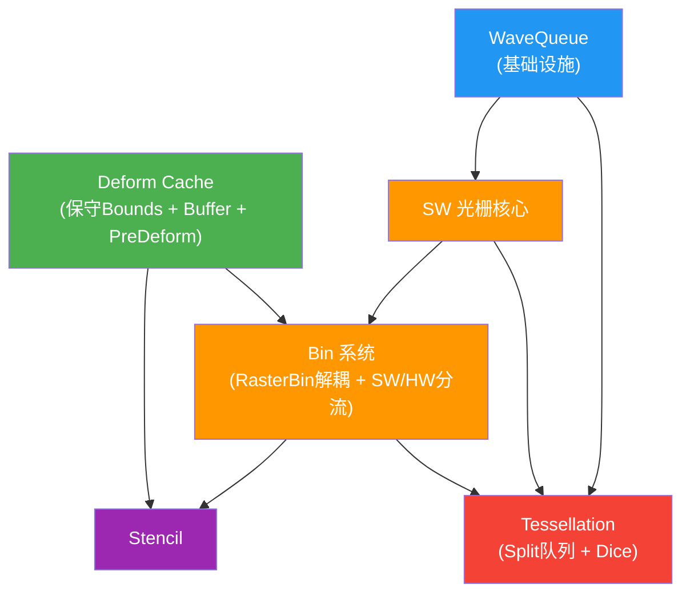

# 可编程光栅化管线设计文档

## 文档索引

| 文档 | 内容 |
|------|------|
| [deform_cache.md](deform_cache.md) | IVertexEvaluate 接口、异构 ByteBuffer 缓存、骨骼继承 GPU 布局、PreDeform on/off |
| [sw_raster.md](sw_raster.md) | SW 光栅核心架构、子像素精度、原子深度测试、SW/HW 深度统一 |
| [tessellation.md](tessellation.md) | Split 全局队列、Dice、Watertight 表、VisBuffer 统一编码、PN Patch 工具 |
| [wave_queue.md](wave_queue.md) | Wave-level 泛型任务分发、Boundary bitmask + countbits O(1) 查找 |
| [bin_system.md](bin_system.md) | RasterBin / ShadeBin 解耦、复合 Bin Key、SW/HW 分流策略 |
| [stencil.md](stencil.md) | HW Stencil (D24S8) 和软件 Stencil (UAV) 两阶段方案 |

## 依赖关系

